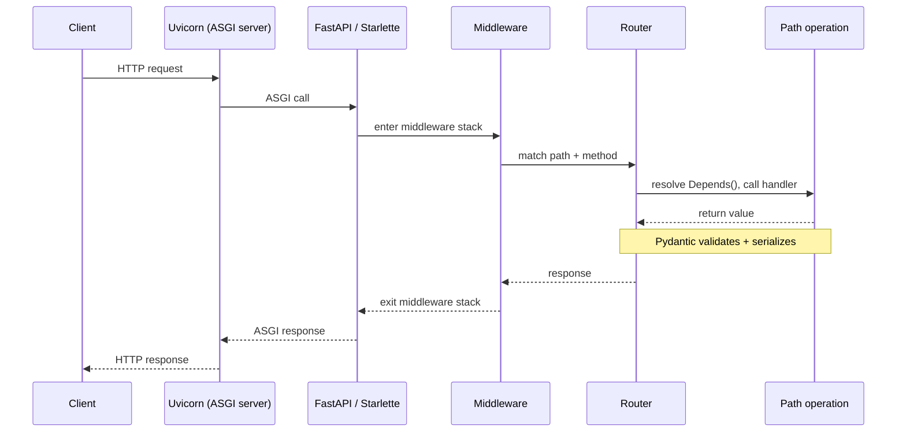

# FastAPI Concepts

Notes on FastAPI features used in this repo.

## Big Picture

**Uvicorn** (ASGI server) accepts the connection.  
**FastAPI** (built on **Starlette**) matches the request to a route and validates data with **Pydantic**.



See: `main.py`, `resources/log-config.yml`

## Routing

`APIRouter` groups related endpoints into their own file instead of piling every route onto the single `FastAPI()` object.  
One file per resource (`emoji`, `mood`, `users`) stays readable as the app grows.

```python
# app/routers/emoji.py
router = APIRouter(prefix="/emoji", tags=["emoji"])


@router.get("/")
async def emojis():
    return {"lucky_caps": ["🍩", "🍺"]}
```

```python
# main.py
app.include_router(emoji.router)  # -> GET /emoji/
```

`prefix`/`tags` on `APIRouter` apply to every route in the file.  
So does `dependencies=[...]` (see Auth below) — set once, applies to all.

See: `app/routers/`, `main.py:54`

## Query Params

Extra values in the URL (`?limit=5`), not the path itself.  
FastAPI infers them from the function signature — no manual `request.query_params.get(...)`.

```python
@router.get("/")
async def emojis(limit: Optional[int] = None): ...  # plain default = type coercion only


@router.get("/search")
async def search(text_mode: Optional[str] = Query(None, min_length=4, pattern=r"CAPS(LOCK)?")):
    ...  # Query(...) adds constraints, enforced pre-handler, shown in OpenAPI docs
```

See: `app/routers/emoji.py:17`, `app/routers/mood.py:14`

## Pydantic (v2)

Defines data shapes and validates them on construction — no manual `isinstance` checks or JSON parsing.  
Use for any structured input/output: request bodies, response shapes.

```python
class User(BaseModel):
    name: str
    email: EmailStr  # validates format
    birthdate: date
    enabled: bool = True

    model_config = ConfigDict(populate_by_name=True)  # replaces v1's `class Config`


User(name="Homer", email="not-an-email", birthdate="1990-01-01")
# ValidationError: value is not a valid email address
```

⚠️ This repo reuses one `User` model for request body, DB round-trip, and response — a known anti-pattern.  
It's not just theoretical: it caused a real bug. `app/services/user.py`'s `find()` strips
`password` before returning, since the same dict is used for `GET /users/{id}` responses. But
`POST /auth` called that same `find()` to check the password hash — so the hash was always
`None` and login always failed, no matter the credentials. The fix adds an `include_password`
opt-in (default `False`) so `find()` can serve both callers safely, but the real fix is to stop
sharing one model: split into `UserCreate` / `UserPublic` / `UserInDB` so "does this leak a
password hash" isn't a runtime flag you have to remember to set correctly at every call site.

See: `app/models.py`, `app/services/user.py`, `tests/test_services.py`

## Middleware

Runs around *every* request/response, before routing picks a handler and after it returns.  
Use for cross-cutting concerns (timing, logging, headers, CORS) that would otherwise repeat in every handler.  
If it's specific to one route, that's a dependency, not middleware.

```python
async def add_process_time_header(request: Request, call_next):
    start = datetime.now(timezone.utc)
    response = await call_next(request)
    response.headers["X-Process-Time"] = str(datetime.now(timezone.utc) - start)
    return response


app.add_middleware(BaseHTTPMiddleware, dispatch=add_process_time_header)
```

See: `app/middlewares.py`, `main.py:51`

## Auth (Depends)

`Depends()` runs a function before the handler, per-route — returns a value the handler can use, or raises to stop the request early.  
Use router-level for "every route here needs this" (auth gates), per-parameter when the
handler also needs the resolved value itself.

```python
SCHEME = OAuth2PasswordBearer(tokenUrl="auth")


async def get_user(token: str = Depends(SCHEME)) -> dict:
    ...  # decode token, load user; raise HTTPException(401) if invalid


router = APIRouter(prefix="/users", dependencies=[Depends(get_user)])  # gate every route


@router.get("/me")
async def who_am_i(user: dict = Depends(get_user)):  # same dep, now need the value itself
    return user
```

Login (`POST /auth`) is unprotected.

See: `app/dependencies.py`, `app/utils/auth.py`, `app/routers/base.py`

## Dynaconf (config files)

Settings layered from TOML files + env vars.  
(`[default]` vs `[prod]`) without hand-rolled `os.environ.get(...)`.  
Use for anything that changes between environments or must never be committed.

See: `app/config.py`
