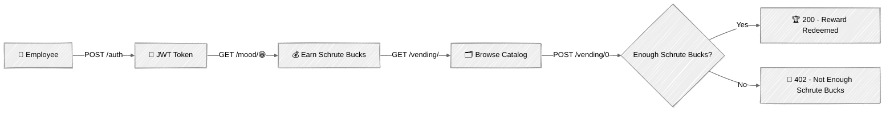

<div align="center">

# Dunder Mifflin Rewards API


My goal with this repository is an in-depth exploration of FastAPI internals, the async
execution model, and production-ready backend design.

**Schrute Bucks Rewards**, an employee rewards app inspired on "The Office" 📎  
Auth is your employee badge, `/mood` is your daily morale check-in (earns Schrute Bucks), `/vending` is where you spend them.

</div>

> Why The Office? Dwight's fake productivity currency needed a real backend. Turning "Schrute Bucks"
> into an actual points economy gave this teaching lab a use case worth earning and spending against,
> instead of a `points` field nothing ever touched.



> [!NOTE]
> To see every endpoint, start the API and check `http://127.0.0.1:8000`  
> The homepage lists them all with copy-paste curl commands.

## Folder Structure

```bash
.
├── app/
│   ├── routers/         # 🚏 API route handlers.
│   ├── services/        # ⚙️ Business logic.
│   ├── utils/           # 🔧 Auth & MongoDB helpers.
│   ├── config.py        # ⚙️ Dynaconf settings loader.
│   └── models.py        # 📦 Pydantic models.
├── resources/
│   ├── init-mongo.js    # 🌱 Mongo init script (creates the API's DB user).
│   ├── log-config.yml   # 📝 Uvicorn logging config.
│   └── settings.toml    # 📝 Dynaconf settings.
├── static/               # 🖼️ Static files served by the API.
├── tests/                # ✅ Unit tests.
├── main.py               # 🚀 FastAPI app entrypoint.
├── Dockerfile            # 🐋 Dockerfile for the API.
└── docker-compose.yml    # 🧩 MongoDB service for local dev.
```

## Getting Started

One-time setup: Python env, dependencies, and a Dynaconf secrets file.

<details>
<summary>Show setup commands 👇</summary>

```bash
# 👇 Virtual Environment
pyenv local 3.10.0
python -m venv .venv && source .venv/bin/activate

# 👇 Dependencies
make install

# 👇 Dynaconf secrets file
echo "
[default]
TOKEN_SECRET_KEY = '$(openssl rand -hex 32)'
" > resources/.secrets.toml
```

</details>

Commands to run the API locally.

<details>
<summary>Show run commands 👇</summary>

```bash
# Start MongoDB
docker-compose up -d

# Seed the Dwight Schrute demo user (dwight@dundermifflin.com / Test1234!)
make seed

# Start the API
make run

# Run tests
make test

# Sanity Check
curl -s http://127.0.0.1:8000/
```

</details>

Or build and run the API itself in a container (still requires `resources/.secrets.toml` and MongoDB running as above).

<details>
<summary>Show docker commands 👇</summary>

```bash
docker build -t dunder-mifflin-api .
docker run -p 8000:8000 --env APP_ENV=dev dunder-mifflin-api
```

</details>

## References

- [FastAPI: docs](https://fastapi.tiangolo.com/) — the framework this whole repo explores
- [pydantic: docs](https://docs.pydantic.dev/) — v2 data validation, used throughout `app/models.py`
- [uv: docs](https://docs.astral.sh/uv/) — dependency management
- [pre-commit: docs](https://pre-commit.com/) — hooks run in CI, see `.pre-commit-config.yaml`
- [MongoDB: Quick Start FastAPI](https://www.mongodb.com/developer/quickstart/python-quickstart-fastapi/) — the ObjectId pattern in `app/models.py` follows this guide
