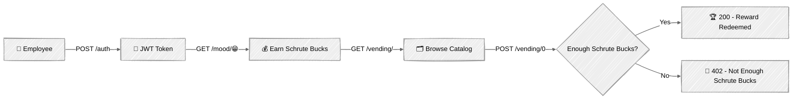

<div align="center">

# Rewards API


My goal with this repository is an in-depth exploration of FastAPI internals, the async execution model, and production-ready backend design.

**Schrute Bucks Rewards**, an employee rewards app inspired on "The Office" 📎

</div>



> [!NOTE]
> Start the API and check `http://127.0.0.1:8000`  
> The homepage has an interactive playground to run every endpoint live,
> plus copy-paste curl commands for each one.

## Getting Started

```bash
# One-time setup
make install
echo "
[default]
TOKEN_SECRET_KEY = '$(openssl rand -hex 32)'
" > resources/.secrets.toml

# Start MongoDB, create the demo user, and run the API
docker-compose up -d
make create-user
make run
```

<details>
<summary>More commands: tests, formatting, Docker 👇</summary>

```bash
# Run tests
make test

# Format & lint (same checks as CI)
uvx pre-commit run --all-files

# Update locked dependencies
make update-deps
```

Or run the API itself in a container (still requires `resources/.secrets.toml` and MongoDB running as above).

```bash
docker build -t dunder-mifflin-api .
docker run -p 8000:8000 --env APP_ENV=dev dunder-mifflin-api
```

</details>

## References

- [FastAPI: docs](https://fastapi.tiangolo.com/) — the framework this whole repo explores
- [pydantic: docs](https://docs.pydantic.dev/) — v2 data validation, used throughout `app/models.py`
- [uv: docs](https://docs.astral.sh/uv/) — dependency management
- [pre-commit: docs](https://pre-commit.com/) — hooks run in CI, see `.pre-commit-config.yaml`
- [MongoDB: Quick Start FastAPI](https://www.mongodb.com/developer/quickstart/python-quickstart-fastapi/) — the ObjectId pattern in `app/models.py` follows this guide
