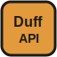
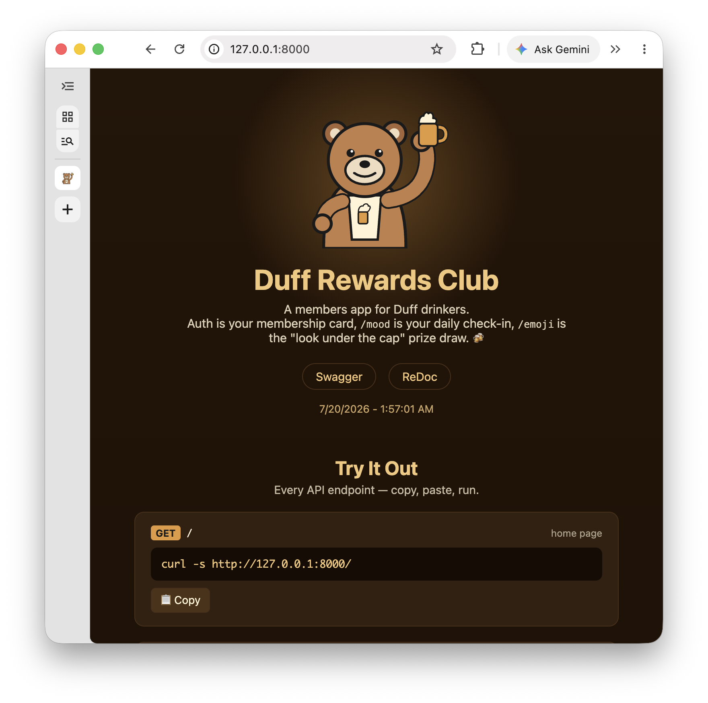

<div align="center">



# `Duff API`


My goal with this repository is an in-depth exploration of FastAPI internals, the async
execution model, and production-ready backend design.

**Duff Rewards Club** — a members app for Duff drinkers. Auth is your membership card, `/mood`
is your daily check-in, `/emoji` is the "look under the cap" prize draw.

</div>

## Endpoints

```text
GET  /                  API home page (HTML)
POST /auth              login -> JWT bearer token
GET  /emoji/            random lucky emojis (auth required)
GET  /emoji/{item}      emoji by index (auth required)
GET  /mood/{item}       mood message by Mood enum (auth required)
GET  /users/me          current authenticated user (auth required)
GET  /users/{id}        user by id (auth required)
POST /users/            create user (auth required)
```

## User Shape

```json
{
  "id": "591528c0-3029-4f8c-9aa8-fee16e271dbd",
  "name": "Homer Simpson",
  "email": "homer@duff.com",
  "birthdate": "1990-01-01",
  "mood": "😁",
  "enabled": true,
  "points": 0,
  "updated_at": "2026-07-19T12:00:00.000000"
}
```

## MongoDB

- Database: `duffDB`, collection: `users`
- `_id` is a Mongo ObjectId-format string, not a real BSON ObjectId
- `resources/init-mongo.js` creates the API's DB user on the container's first start

## Folder Structure

```bash
.
├── app/
│   ├── routers/         # 🚏 API route handlers.
│   ├── services/        # ⚙️ Business logic.
│   ├── utils/           # 🔧 Auth & MongoDB helpers.
│   ├── config.py        # ⚙️ Dynaconf settings loader.
│   └── models.py        # 📦 Pydantic models.
├── resources/
│   ├── init-mongo.js    # 🌱 Mongo init script (creates the API's DB user).
│   ├── log-config.yml   # 📝 Uvicorn logging config.
│   └── settings.toml    # 📝 Dynaconf settings.
├── static/               # 🖼️ Static files served by the API.
├── tests/                # ✅ Unit tests.
├── main.py               # 🚀 FastAPI app entrypoint.
├── Dockerfile            # 🐋 Dockerfile for the API.
└── docker-compose.yml    # 🧩 MongoDB service for local dev.
```

## Getting Started

One-time setup: Python env, dependencies, and a Dynaconf secrets file.

<details>
<summary>Show setup commands 👇</summary>

```bash
# 👇 Virtual Environment
pyenv local 3.10.0
python -m venv .venv && source .venv/bin/activate

# 👇 Dependencies
make install

# 👇 Dynaconf secrets file
echo "
[default]
TOKEN_SECRET_KEY = '$(openssl rand -hex 32)'
SECRET = '🍺'  # Dev Secret

[prod]
SECRET = '🤫'
" > resources/.secrets.toml
```

</details>

Commands to run the API locally.

<details>
<summary>Show run commands 👇</summary>

```bash
# Start MongoDB
docker-compose up -d

# Start the API
make run

# Run tests
make test

# Sanity Check
curl -s http://127.0.0.1:8000/
```

</details>

- API Home: `http://127.0.0.1:8000`
- Swagger: `http://127.0.0.1:8000/docs`
- ReDoc: `http://127.0.0.1:8000/redoc`



## Docker

Build and run the API itself in a container (still requires `resources/.secrets.toml` and MongoDB running as above).

<details>
<summary>Show docker commands 👇</summary>

```bash
docker build -t duff-api .
docker run -p 8000:8000 --env APP_ENV=dev duff-api
```

</details>

## References

- [FastAPI: docs](https://fastapi.tiangolo.com/) — the framework this whole repo explores
- [pydantic: docs](https://docs.pydantic.dev/) — v2 data validation, used throughout `app/models.py`
- [uv: docs](https://docs.astral.sh/uv/) — dependency management
- [pre-commit: docs](https://pre-commit.com/) — hooks run in CI, see `.pre-commit-config.yaml`
- [MongoDB: Quick Start FastAPI](https://www.mongodb.com/developer/quickstart/python-quickstart-fastapi/) — the ObjectId pattern in `app/models.py` follows this guide

> 💡 Copy-pasteable curls for the public endpoints above are on the running homepage itself (`http://127.0.0.1:8000`) — see the "Try It Out" section.
